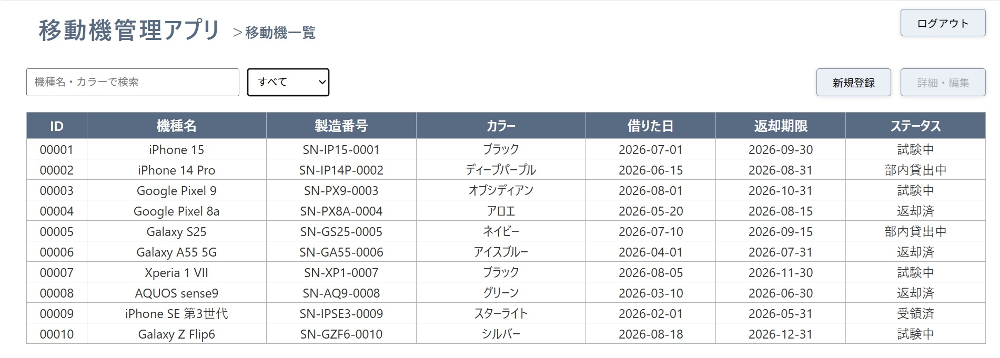
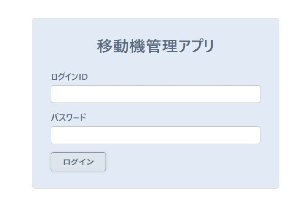
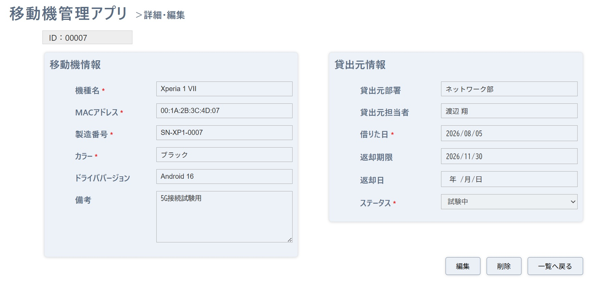
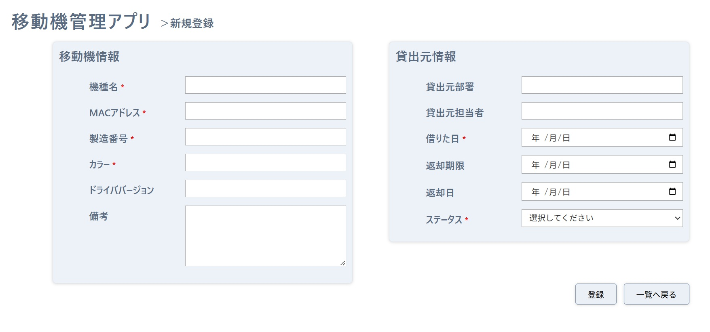
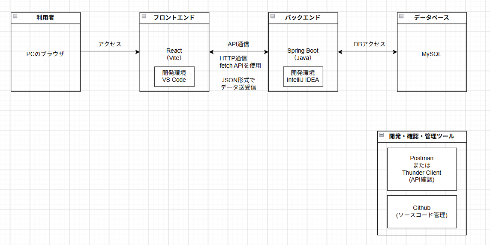
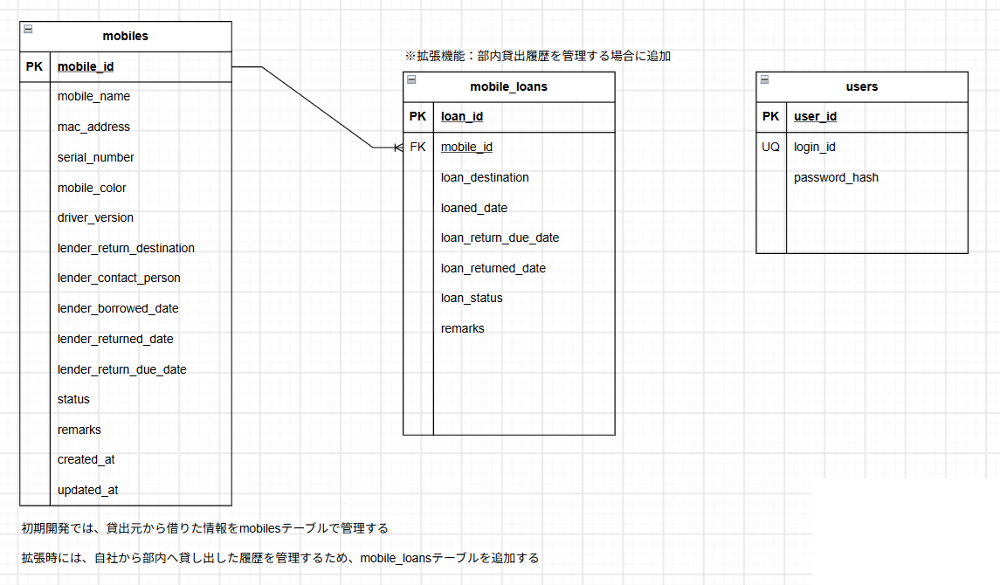

# 移動機管理アプリ

**業務用の移動機情報と利用状況を一元管理するWebアプリケーション**



業務で使用するスマートフォンなどの移動機について、端末情報や貸出状況、返却期限などを一元管理するためのアプリケーションです。

---

## アプリケーション概要

移動機の情報を登録・管理し、現在の貸出状況や返却期限を確認できるWebアプリケーションです。

機種名やカラーによる検索、ステータスによる絞り込みに対応しており、多数の端末の中から目的の端末を簡単に確認・管理できます。

主な管理項目は以下のとおりです。

* 機種名
* MACアドレス
* 製造番号・端末識別番号
* カラー
* ドライババージョン
* 貸出元部署
* 貸出元担当者
* 借用日
* 返却日
* 返却期限
* ステータス
* 備考

---

## アプリケーションURL

現在、本番環境へのデプロイは行っておらず、ローカル環境で動作します。

ローカル起動時：

```text
http://localhost:5173
```


---

## 開発した背景

以前の業務で、検証用の携帯端末を使用・管理する機会がありました。

他部署から借用した端末について、製造番号やドライババージョンなどの端末情報に加え、貸出元や返却期限なども管理する必要があり、管理業務が煩雑になりやすいと感じていました。

また、借用した端末を部署内でさらに貸し出すケースもあり、端末の所在や利用状況を把握しやすくする必要がありました。

この経験から、移動機に関する情報を一つの画面から確認・管理できる仕組みがあると便利だと考え、本アプリケーションを制作しました。

実際の業務で利用することを想定し、複雑な操作を必要とせず、必要な情報を簡単に検索・確認・更新できることを意識しています。


---

## 主な機能

### ログイン

登録されているユーザー情報を使用してログインします。
未認証の状態では、移動機情報を取得するAPIへアクセスできないようにしています。

### 移動機一覧表示

登録されている移動機を一覧で確認できます。
一覧画面から各端末の詳細画面へ移動できます。

### キーワード検索

機種名またはカラーを入力して、対象となる移動機を絞り込むことができます。

### ステータス絞り込み

端末のステータスを指定して一覧を絞り込むことができます。

### 移動機詳細表示

選択した移動機について、登録されている詳細情報を確認できます。

### 移動機登録

新しい移動機情報を登録できます。
入力内容にはバリデーションチェックを行い、不正な値が登録されないようにしています。

### 移動機編集

登録済みの移動機情報を編集できます。
編集をキャンセルした場合は、変更前の内容に戻るようにしています。

### 移動機削除

不要になった移動機情報を削除できます。

### ログアウト

ログイン中のセッションを終了し、ログイン画面へ戻ります。

---

## 画面イメージ

### ログイン画面



### 移動機一覧画面


### 詳細・編集画面



### 新規登録画面




---

## 工夫した点

### 実際の業務を想定した項目設計

単純な端末名だけではなく、MACアドレスや製造番号、ドライババージョン、貸出元、返却期限など、実際の端末管理業務で必要になる情報を管理できるようにしました。

### 検索対象を必要な項目に限定

MACアドレスや製造番号は英数字が多く、短いキーワードでは大量の端末がヒットする可能性があるため、キーワード検索は機種名とカラーを対象としています。

### 入力値の正規化

入力された文字列について、前後の空白除去や全角・半角の正規化などを行い、表記揺れをできるだけ防ぐようにしています。
MACアドレスについては、大文字へ統一して保存します。

### フロントエンド・バックエンド双方での入力チェック

入力内容についてバリデーションを行い、不正なデータが登録されないようにしています。

### 認証機能

Spring Securityを使用してログイン認証を実装し、ログインしていないユーザーからのAPIアクセスを制限しています。
パスワードはBCryptを使用してハッシュ化しています。

---

## 使用技術

### フロントエンド

* HTML
* CSS
* JavaScript
* React
* React Router
* Vite

### バックエンド

* Java
* Spring Boot
* Spring Web
* Spring Data JPA
* Spring Security
* Bean Validation

### データベース

* MySQL

### 開発・管理ツール

* Visual Studio Code
* Git
* GitHub
* Postman
* npm
* Maven
* IntelliJ IDEA

---

## システム構成



本アプリケーションは現在、ローカル環境での動作を想定しています。

ReactからSpring BootのREST APIを呼び出し、Spring Data JPAを介してMySQLのデータを操作します。

---

## ER図



現在のバージョンでは、移動機情報を `mobiles` テーブル、
ログイン認証用のユーザー情報を `users` テーブルで管理しています。

`mobile_loans` テーブルは、今後、部内貸出履歴を管理するための拡張案です。

---

## API一覧

| メソッド   | URL                    | 内容       |
| ------ | ---------------------- | -------- |
| POST   | `/login`               | ログイン     |
| GET    | `/auth/me`             | ログイン状態確認 |
| GET    | `/mobile-devices`      | 移動機一覧取得  |
| GET    | `/mobile-devices/{id}` | 移動機詳細取得  |
| POST   | `/mobile-devices`      | 移動機登録    |
| PUT    | `/mobile-devices/{id}` | 移動機更新    |
| DELETE | `/mobile-devices/{id}` | 移動機削除    |
| POST   | `/logout`              | ログアウト    |

---

## ローカル環境での起動方法

### 1. リポジトリをクローン

```bash
git clone https://github.com/ichisemkk/mobile-device-management.git
```

```bash
cd mobile-device-management
```

### 2. MySQLの準備

MySQLを起動し、以下のデータベースを作成します。

```sql
CREATE DATABASE mobile_device_management;
```

Spring Boot側のデータベース接続設定を、自身のMySQL環境に合わせて設定してください。

### 3. バックエンドを起動

```bash
cd backend
```

Windowsの場合：

```bash
mvnw spring-boot:run
```

バックエンドは以下で起動します。

```text
http://localhost:8080
```

### 4. フロントエンドを起動

別のターミナルを開き、プロジェクトのルートディレクトリから以下を実行します。

```bash
cd frontend
npm install
npm run dev
```

フロントエンドは以下で起動します。

```text
http://localhost:5173
```

ブラウザからアクセスしてアプリケーションを利用します。

---

## 今後追加したい機能

今後の拡張として、以下の機能を検討しています。

* 部内貸出履歴の管理
* ドライババージョンの変更履歴管理
* 検索機能の拡張
* 本番環境へのデプロイ

---

## 制作について

職業訓練の修了制作として、React・Spring Boot・MySQLを使用して制作しました。

フロントエンドからバックエンドAPIを呼び出し、データベースへの登録・取得・更新・削除を行う、一連のWebアプリケーション開発を実践することを目的としています。
